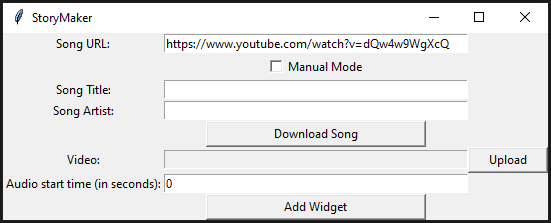

<h1 style="text-align:center;">YouTube Music Widget</h1>


Note: The Windows GUI is deprecated, and CLI should be used instead, but the code for the GUI is still included for use at your own disposal.

<h4>Description:</h4>
<p> YouTube Music Widget is a simple web application that allows you to add music from YouTube to any local video you upload. With this app, you can easily create customized videos for your Instagram stories or any other platform that requires background music.</p>

<h4>Use cases:</h4>
<p> Instagram Music is restricted in some regions (due to copyright or whatever reasons), and I wanted a way to add music to my stories. This app lets me easily add any music from YouTube to videos without any hassle. Another use case might be to add sounds from YouTube that you can't normally find on Instagram.</p>


## Command Line Interface Usage:


### Download Command

This command allows you to download a song from a YouTube URL.

```
python sm_cli.py download <url> [--manual-mode] [--title <title>] [--artist <artist>]
```

#### Arguments

- `url`: The YouTube URL of the song to download
- `--manual-mode`: Use manual mode to enter the song title and artist
- `--title`: The title of the song (only used if `--manual-mode` is set)
- `--artist`: The artist of the song (only used if `--manual-mode` is set)

#### Example

```
python sm_cli.py download https://www.youtube.com/watch?v=dQw4w9WgXcQ --manual-mode --title "Never Gonna Give You Up" --artist "Rick Astley"
```

### Widget Command

This command allows you to add a widget to a video.

```
python sm_cli.py widget <video_path> <audio_start_time>
```

#### Arguments

- `video_path`: The path to the video file
- `audio_start_time`: The start time of the audio to add, in seconds

#### Example

```
python sm_cli.py widget my_video.mp4 30
```

### Man Command

This command displays the manual page.

```
python sm_cli.py man
```

If no command is provided, the manual page will be displayed.


<p>Thank you for using YouTube Music Widget! If you have any feedback or suggestions, please feel free to contact me.</p>
